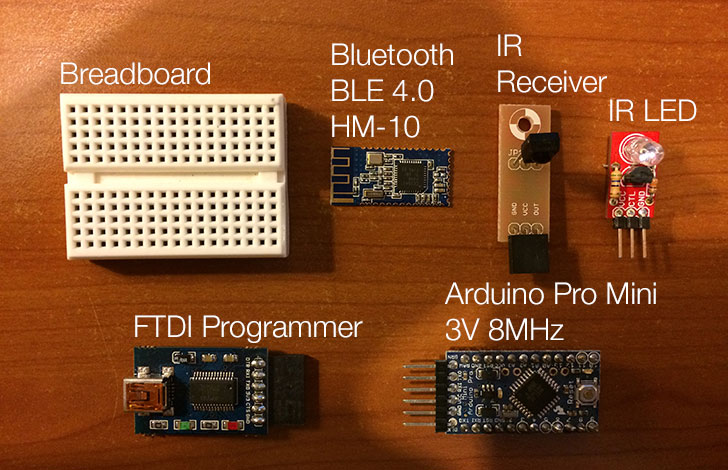
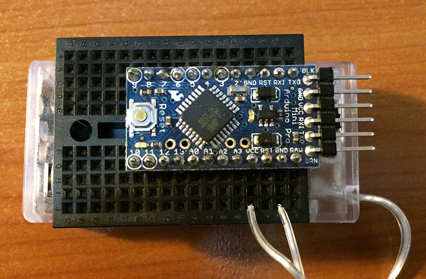
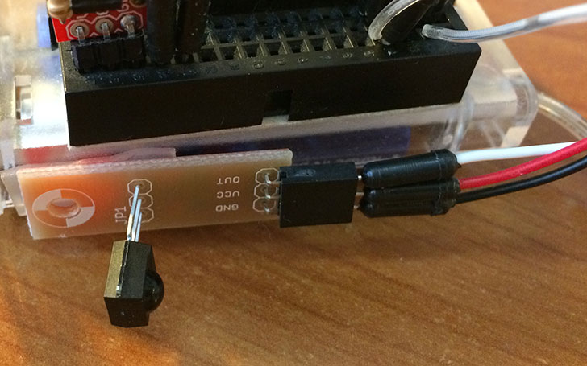
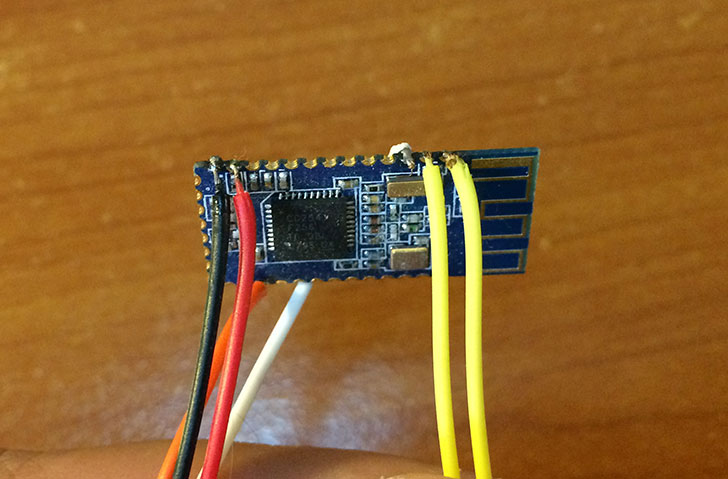
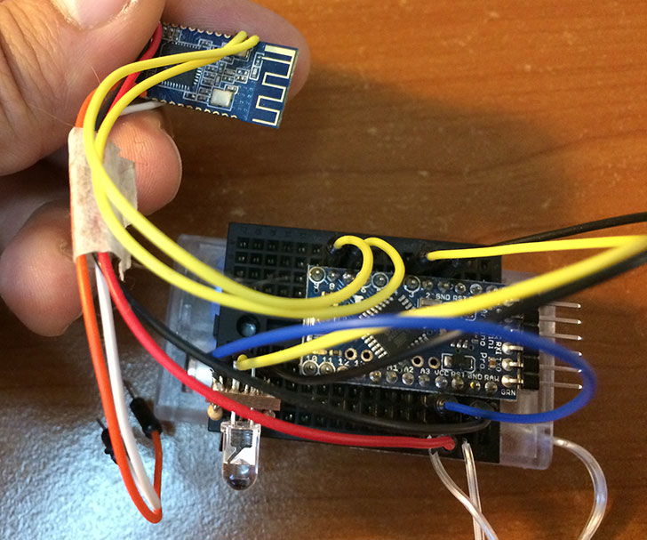
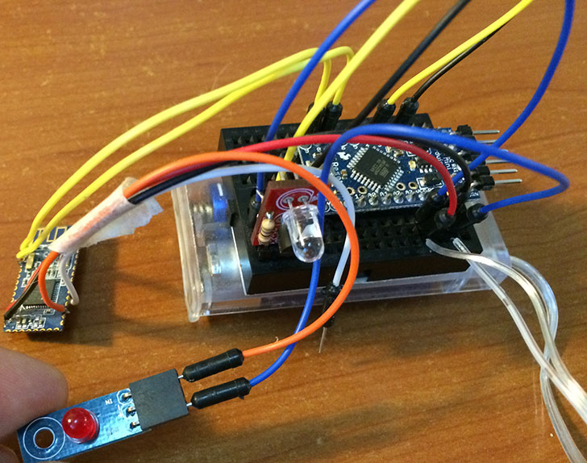
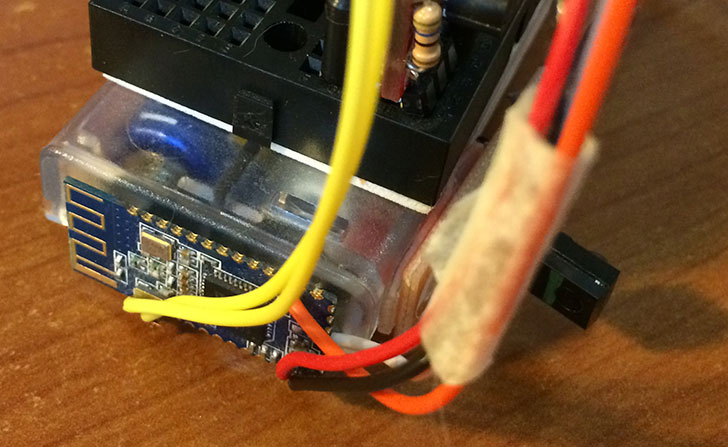
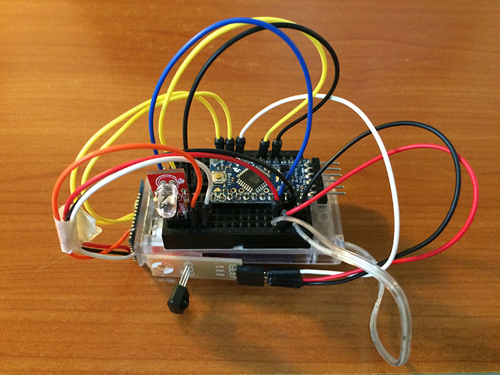

Warning: this project has been discontinued
==========
Although the arduino DYI hardware still works, the pairing application (the AnyMote app) won't discover it as a valid AnyMote device. This is because none of the available BLE modules for Arduino allow for custom discovery data, which would make the overall connection & discovery of both AnyMote and Arduino DYI Anymotuinos significantly slower (10x slower)

anymotuino
==========

__anymotuino__ is an Arduino clone of our __AnyMote__ device (you can follow our KickStarter campaign [here](https://www.kickstarter.com/projects/1635386542/anymote-home-your-phone-the-ultimate-universal-rem)).

It behaves almost exactly as our __AnyMote__ device, although it lacks the optimisations we were able to integrate in our custom board and firmware.

__anymotuino__ follows the same protocol as __AnyMote__, so you can safely use it with our AnyMote [iOS (early beta)](https://colortiger.com/iosbeta) and [Android](https://play.google.com/store/apps/details?id=com.remotefairy&hl=en) applications.

What hardware do I need to build it? (Bill Of Materials)
========================================================

You can basically use any Arduino board along with a Bluetooth LE 4.0 compatible serial data module and InfraRed LED, but for the purposes of this example, we have chosen to use an Arduino Pro Mini (3.3V version) and an HM-10 BLE board, mainly to keep things nice and compact, while running on 2x AA batteries.

Here's the Bill Of Materials for this project:

1. [Arduino Pro Mini – 3.3V, 8MHz version](https://www.sparkfun.com/products/11114) (there's also a 5V, 16MHz version, but we only need 3V)
2. [HM-10 BLE 4.0 module](http://www.fasttech.com/product/1292002-ti-cc2540-cc2541-bluetooth-4-0-ble-2540-2541) (based on TI's powerful CC2540 BLE chip)
3. [Max Power IR LED Kit](https://www.sparkfun.com/products/10732) (Any IR LED will do, but this kit allows you to get the most power out of your Arduino for the best range)
4. [IR Receiver](http://www.adafruit.com/products/157?&main_page=product_info&cPath=35&products_id=157) (used for IR recording, if you need it)
5. [Mini Breadboard](https://www.sparkfun.com/products/12047)
6. Wires
7. [2xAA Battery Enclosure](https://www.sparkfun.com/products/9543) (I recommend buying one with a switch on it)



What software do I need to run it?
==================================

You need Arduino 1.0+ obviously, and you also need Ken Shirriff's [IRRemote library](https://github.com/shirriff/Arduino-IRremote).

How do I put it all together?
=============================

Here comes the fun part. Put your DIY glasses on and let's build this thing!
You can also find the Fritzing schematic [here](fritzing/Anymotuino.fzz).

1. Build the core of the device
-------------------------------

Stick the breadboard to the battery enclosure's back (all breadboards have a sticky double sided tape on their back). If you have a case with a switch on it, make sure you're not pasting the breadboard over it.

Then connect the Arduino Pro Mini on the breadboard as suggested in this photo. Make sure it goes over the length of the breadboard so we have both halves usable for connections.



2. Connect the Power IR breakout
--------------------------------

The breakout requires VCC and GND connections + the CTL pin. The CTL pin goes to pin 3 of the Arduino Pro Mini (which is a PWM pin, required for fast IR "ticks").


3. Connect the IR receiver breakout (optional)
----------------------------------------------

__anymotuino__ knows how to record IR codes as well. So if you bought an IR receiver breakout, you can use it by connecting the VCC and GND pins to their respective counterparts on our Breadboard, and the OUT pin to pin 6 on the Arduino board.



4. Solder the connections to the HM-10 module
---------------------------------------------

Normally you would need a [breakout board](https://oshpark.com/shared_projects/aWRbRvyh) for the HM-10 module, but for the purposes of our project, we'll solder the wires directly to the small board as in the photo. 

So, holding the module with the antenna on top, the first 2 pins on the bottom left side are GND and VCC, respectively; the 2 pins on the top left side are RX and TX, respectively. There's another pin you might want to solder since we're here, the status signal, useful for debugging. It's the 3rd pin on the bottom right side (orange wire in the photo).



For more info, you can find the full schematics and documentation for the HM-10 [here](http://www.jnhuamao.cn/bluetooth40_en.zip).

5. Wire the HM-10 module to our Arduino Pro Mini
------------------------------------------------

Wiring it to the arduino is easy as pie once you soldered the wires. The VCC and GND wires go to their respective counterparts on our breakboard, while the RX and TX go to our 8 and 7 pins on the Arduino. In the Arduino sketch, the Serial connection is made to read from pin 8 and write to pin 7 (RX on the BLE goes to TX on the arduino and TX of the BLE to RX of the arduino).



Optionally, connect a LED to the status output of the HM-10 to debug connectivity. Blinking means not connected to a BLE device, solid means connected. The orange wire goes to the input end of the LED, while the GND goes to the arduino's GND.



6. That's it for the hardware
-----------------------------

I also applied 2 small pieces of double sided tape to hold the BLE module and the IR recorder together with our rudimentary-but-nonetheless-cool __anymotuino__ box:



Final look:



Don't forget, you can also find the Fritzing schematic [here](fritzing/Anymotuino.fzz).

Installing the Arduino Sketch and usage
=======================================

Sketch Installation And Configuration
-------------------------------------

You first need to install the [IRRemote](https://github.com/shirriff/Arduino-IRremote) library in your Arduino SDK's libraries folder. 

__Important:__ _You may get this error on compile on the latest Arduino IDE: `error: 'TKD2' was not declared in this scope`. The IRremote library is included in the RobotIRremote library shipped with the latest versions of the Arduino IDE which causes a conflict (the included version of IRremote is pretty old). Until the Arduino IDE devs fix this issue, you can get back to a successful build by deleting the RobotIRremote libary from the Arduino libraries folder, then close and reopen the Arduino IDE and rebuild._

__Important:__ _If you want to use the IR Recording feature, you have to make a small adjustment in the `IRRemote.h` file of the IRRemote library before opening the Arduino IDE:_

Replace this line:

```
#define USECPERTICK 50
```

With this snippet:
```
#ifndef USECPERTICK
#define USECPERTICK 50
#endif
```

This allows us to easily change the microsecond per signal tick as we need in our sketch. If you don't need this functionality, you can leave it as is.

Then fire up the Arduino IDE and load the [sketch](anymotuino/anymotuino.ino).

Connect the FTDI programmer to the Arduino Pro Mini board, then connect the FTDI programmer to a USB board on your computer.
Make sure you select the appropriate board type and serial port (Arduino Pro Mini 3.3V 8MHz ATmega328 and the appropriate Serial Port). Then choose `File > Upload` (or hit Command+U on OS X).

Once it's complete, you're able to use the __anymotuino__ with the SmartRemote/AnyMote iOS or Android application as an external IR blaster.

Enjoy!

